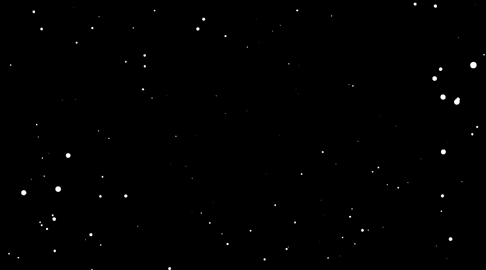

# starfield-go
## Preview

This is a simple starfield simulation created in Go for practice purposes. The simulation uses the Ebitengine library to render moving stars on the screen, giving the illusion of traveling through space.